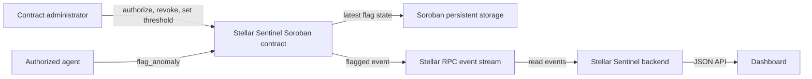

# Stellar Sentinel Soroban Contract

[](https://github.com/Stellar-Sentinel/sentinel-contracts/actions/workflows/ci.yml)
[](LICENSE)

Soroban contract for administrator-managed monitoring and response roles, a configurable 0–100 score threshold, and account flags. It publishes flag and administrative events and stores the latest flag for each subject. It does not store full history; event indexing is needed for that.

## Agent registry

`get_agents` returns the administrator-authenticated list of active agents. The registry has a configurable capacity up to 128 addresses; repeated authorization is idempotent, and revocation or grant expiry releases capacity. Legacy `authorize_agent` grants responder access. Explicit monitor and responder roles can be managed independently. Expiring grants are supported for up to 100,000 ledgers.

## Architecture



The backend reads events and does not sign or submit transactions. The contract and backend RPC must use the same network for events to appear in the dashboard.

### Configuration events

Initialization and administrative changes publish typed Soroban events for off-chain audit consumers:

| Topic 0 | Additional topics | Value | Meaning |
| --- | --- | --- | --- |
| `agent_add` | administrator address, affected agent address | `true` | The agent was authorized. |
| `agent_del` | administrator address, affected agent address | `false` | The agent was revoked. |
| `threshold` | administrator address | `(previous_threshold, new_threshold)` as two `u32` values | The risk threshold changed. |
| `init` | administrator address | `u32` threshold | The contract was initialized. |
| `pause` | administrator address | `bool` | New flag submissions were paused or resumed. |
| `gpause` / `gunpause` | guardian or administrator address | `bool` | Guardian pause state changed. |

The existing `flagged` event remains unchanged: its topics are `flagged`, agent address, and subject address, and its value is the `u32` score. The backend also decodes `flaggedv2` reports. Administrative event indexing is not currently shown in the dashboard. A failed or unauthorized call aborts before publishing an event.

## Testnet deployment

The current Stellar Sentinel instance is deployed and initialized on the **Stellar Testnet**. It uses the Testnet network passphrase `Test SDF Network ; September 2015` and the Soroban RPC endpoint `https://soroban-testnet.stellar.org`.

| Detail | Value |
| --- | --- |
| Contract ID | [`CCZAAZ3FJ7LKZA7E7A6EKQTU2HCNVI3YUVIHKWHSULGZSWAJFS2D2XVX`](https://stellar.expert/explorer/testnet/contract/CCZAAZ3FJ7LKZA7E7A6EKQTU2HCNVI3YUVIHKWHSULGZSWAJFS2D2XVX) |
| Contract source | [`5b6b5a7`](https://github.com/Stellar-Sentinel/sentinel-contracts/commit/5b6b5a7df1219242579833d0f46f4f215745eca1) |
| Wasm SHA-256 | `f501250438515ff26e18ebf951cd62de717c711e68d031fb0fad5c9a9b36bd5d` |
| Score threshold | `70` (initialized) |
| Admin account | `GAPNXDMWAMEWHEVMSDXYD5BS2V3P6E4A7OPG6F2MLME5666VSPT5BIHM` |
| Authorized monitoring agents | None yet |

Transaction records:

- Wasm upload: [transaction `3838b8af1eadb429f37e7d4c3d6c8267773b138a967d13b816491090a32e3992`](https://stellar.expert/explorer/testnet/tx/3838b8af1eadb429f37e7d4c3d6c8267773b138a967d13b816491090a32e3992)
- Contract deployment: [transaction `903e26dd3d1740d3833714fa30afaaf6466e0823c40250d842944dded6b8e123`](https://stellar.expert/explorer/testnet/tx/903e26dd3d1740d3833714fa30afaaf6466e0823c40250d842944dded6b8e123)
- Initialization: [transaction `bfd4da30f78d13160f95b6d401983db6f70bbba11273e9374989e5b4d0c19b2d`](https://stellar.expert/explorer/testnet/tx/bfd4da30f78d13160f95b6d401983db6f70bbba11273e9374989e5b4d0c19b2d)

The admin identity alias `stellar-sentinel-testnet-admin` is stored in the deploying machine's macOS Keychain using Stellar CLI secure storage. Its secret is not in this repository. Preserve the Keychain entry and securely back up the recovery material. The backend's `.env.example` points to this contract. The event feed is connected, but it currently has no flags because no monitoring agent has been authorized.

### Reproduce a separate Testnet deployment

These commands create a **new** identity and contract instance; they do not redeploy or alter the contract above. Install the Stellar CLI, Rust, and the Wasm target first. Keep the generated identity in secure storage and never commit its seed phrase.

```bash
stellar keys generate sentinel-admin --network testnet --fund --secure-store
stellar contract build --locked
stellar contract deploy \
  --wasm target/wasm32v1-none/release/sentinel_contract.wasm \
  --source-account sentinel-admin \
  --network testnet \
  --alias sentinel_contract
stellar contract invoke \
  --id sentinel_contract \
  --source-account sentinel-admin \
  --network testnet -- \
  initialize --admin sentinel-admin --default-threshold 70
```

To verify this deployment's initialized threshold without submitting a transaction:

```bash
stellar contract invoke \
  --id <CONTRACT_ID> \
  --source-account sentinel-admin \
  --network testnet --send=no -- \
  get_threshold
```

Set the resulting contract ID as the backend's `CONTRACT_ID`. Keep its Horizon and Soroban RPC endpoints on Testnet as well.

## Project layout

- `src/lib.rs` — contract entry points, storage keys, authorization, threshold checks, event publication, and latest-flag lookup.
- `src/test.rs` — contract behavior tests using Soroban test utilities.
- `Cargo.toml` / `Cargo.lock` — Rust and Soroban SDK dependencies.
- `.github/workflows/ci.yml` — Wasm build, unit tests, and Clippy checks.

## Build and test

Requires stable Rust, the `wasm32-unknown-unknown` and `wasm32v1-none` targets, and Stellar CLI for optimized deployment builds. There are no contract-specific environment variables; network IDs and signing identities are supplied to deployment tooling outside this repository.

```bash
rustup target add wasm32-unknown-unknown wasm32v1-none
cargo build --target wasm32-unknown-unknown --release
stellar contract build --locked
cargo test
cargo clippy --all-targets -- -D warnings
```

The CI Wasm artifact is under `target/wasm32-unknown-unknown/release/`. `stellar contract build --locked` creates the optimized deployable artifact under `target/wasm32v1-none/release/`. CI runs the Wasm build, tests, and lint checks (Clippy).

## Contract interface

- `get_interface_version()` — return the interface generation; increment it for incompatible method or event changes.
- `get_contract_config()` — read the administrator and threshold together; returns `None` before initialization.
- `get_storage_version()` / `migrate_storage_version(admin)` — inspect and backfill the instance storage schema version.
- `initialize(admin, default_threshold)` — one-time admin and threshold setup.
- `is_initialized()` — check configuration state without causing an uninitialized-state panic.
- `get_admin()` — read the configured administrator after initialization.
- `transfer_admin(current_admin, new_admin)` — require both addresses to authorize an administrator handover.
- `authorize_agent(admin, agent)` / `revoke_agent(admin, agent)` — manage legacy responder grants. `authorize_monitor` / `authorize_responder` and matching revoke methods manage roles independently. Batch methods handle up to 16 addresses; `revoke_self(agent)` lets an agent remove its own grant.
- `authorize_agent_until(admin, agent, expires_at_ledger)` — grant responder access through a ledger-bounded expiry.
- `set_agent_capacity(admin, capacity)` / `get_agent_capacity()` / `get_agent_count()` / `get_agents(admin)` — manage and inspect the capped agent registry. `migrate_agent_capacity` supports existing instances.
- `set_threshold(admin, threshold)` / `get_threshold()` — configure/read the threshold. Repeating the current value refreshes instance TTL without rewriting state or emitting a duplicate audit event.
- `is_score_accepted(score)` — preflight the score range and active threshold; `flag_anomaly` remains authoritative.
- `pause(admin)` / `unpause(admin)` / `set_paused(admin, paused)` / `is_paused()` — stop or resume new flag submissions; read operations remain available.
- `set_emergency_guardian(admin, guardian)` / `guardian_pause(guardian)` / `resume_from_guardian_pause(admin)` — provide a guardian with pause-only emergency authority.
- `is_agent(agent)` — check agent authorization and extend the active contract instance TTL.
- `flag_anomaly(agent, subject, score)` — require an authorized agent and a score at or above threshold; persist the latest record and publish `flagged`.
- `flag_anomaly_v2(agent, subject, score, report_digest)` — apply the same validation and record update, then publish a versioned event with a fixed 32-byte report digest.
- `flag_anomalies(agent, submissions)` — submit 1–16 subject/score entries in one transaction, validating the full batch before writes.
- `get_latest_flag(subject)` — read the latest record, if one exists.
- `clear_latest_flag(admin, subject)` — clear a subject's latest record; previously published events remain available for indexing.

Successful initialization and state-changing administrative calls publish the corresponding events described above. Read methods do not extend the TTL of each grant; expired grants are removed from the active registry when agent counts or lists are refreshed.

Only trusted addresses should receive agent authorization. The contract enforces the score range and threshold, but it cannot establish that an off-chain score is accurate. Storage follows Soroban TTL and archival rules. Deploy, initialize, and configure each network separately; never commit secrets.

Pausing is an emergency control for all flag submission methods. It does not erase existing flags or block read methods, and new deployments start unpaused. The administrator controls the standard pause; an optional guardian can pause, while only the administrator can resume a guardian pause.

For an administrator handover, prepare one `transfer_admin` invocation authorized by both the current admin and the proposed admin. The operation fails without either authorization, and the proposed address becomes the sole administrator after success. Verify the new administrator can call an admin-only method before removing access to the old signing setup.

`flag_anomaly_v2` preserves the original entry point and `flagged` event. It publishes `flaggedv2` with topics `(flaggedv2, agent, subject, report_digest)` and the `u32` score as event data. The digest is exactly 32 bytes; off-chain producers must agree on canonical report bytes before hashing (for example, SHA-256). Raw reports and the digest are not added to `FlagRecord`; `get_latest_flag` continues returning only the latest agent, score, ledger, and timestamp. The backend decodes these events for its dashboard feed.
